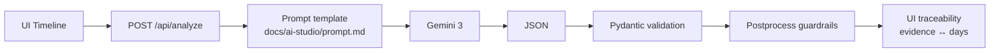

# Intent Drift Radar – Architecture

## Overview

Intent Drift Radar takes a **time-ordered stream of user signals** (e.g. Day 1..Day N) and asks Gemini 3 to decide whether the user’s **original intent has drifted** to a new intent. The system returns a **deterministic, schema-bound result**: baseline intent, current intent, drift yes/no, confidence, **evidence tied to specific days**, **reasoning cards** with day refs, and a **compact drift signature** (`IDR:v1|...`). The UI exposes full **traceability**: evidence and reasoning cards link to timeline days so judges can see exactly which days drove the decision. No login; run Judge Mode for a one-click evaluation.

## Flow

## Deterministic Contract

- **Drift signature** (`drift_signature`): Compact, parseable string for agents. Format `IDR:v1|dir=<FROM>><TO>|span=<Nd>|e=<count>|conf=<0.xx>`. Postprocess normalizes `>>` to `>` and enforces the `IDR:v1|` prefix.
- **Evidence day refs**: Every evidence item has a `day` (e.g. "Day 1", "Day 3"). Reasoning cards have `refs` arrays listing which days support that card. The UI uses these to highlight timeline days on hover/click and to show **evidence ↔ days** traceability.

## Reliability

- **25s timeout** on Gemini API calls; 504 and structured error code if exceeded.
- **Retry-with-repair once**: If the model’s JSON fails validation or postprocess, the backend retries once with a repair instruction before returning 502.
- **Model fallback on 404**: If the configured model returns 404, the backend lists available models and retries with a fallback (e.g. `gemini-3-pro-preview` → `gemini-3-pro` → `gemini-3-flash-preview`).
- **Structured error codes**: API errors return `{"error": {"code": "...", "message": "..."}}` (e.g. `GEMINI_API_KEY_MISSING`, `MODEL_TIMEOUT`, `MODEL_OUTPUT_INVALID`).

## Security

- **Secret Manager injection**: In production (e.g. Cloud Run), `GEMINI_API_KEY` is injected from Secret Manager at runtime. No API keys are stored in code or in Terraform state. The runtime service account is granted `roles/secretmanager.secretAccessor` on the secret.
